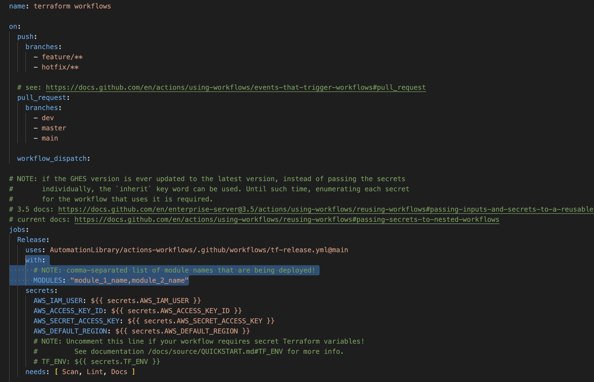
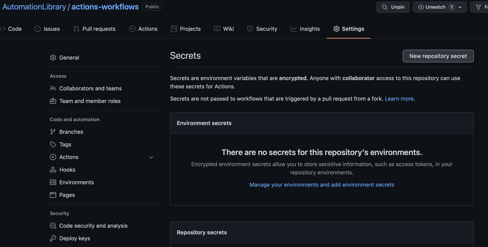
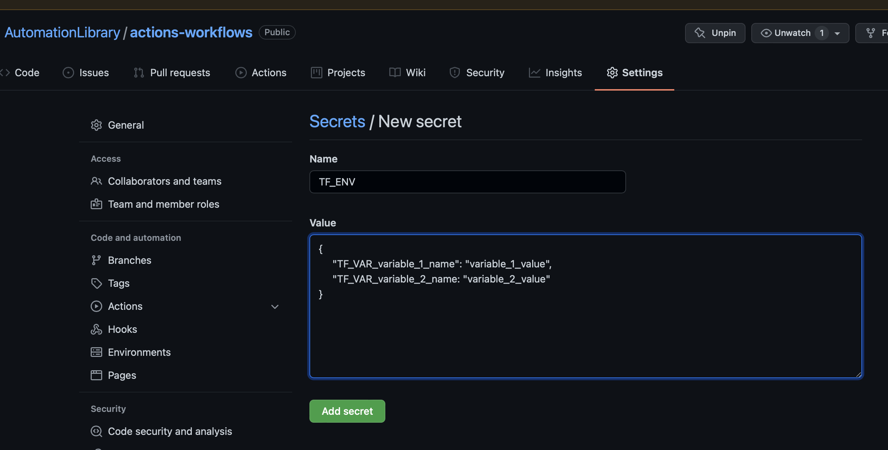

# Quickstart

Depending on the type of package you are developing, you will need to use a different sample file found within this repository to setup your _Continuous Integration_. Currently, we only support **Terraform** module _continuous integration_. 

## Terraform

### Template

The _Automation-Library_ has created a **Terraform** project template [found here](https://github.boozallencsn.com/AutomationLibrary/terraform-module-template). This template is pre-configured for our pipeline. You can clone the template and then add your own project's remote,

```shell
git clone git@github.boozallencsn.com:AutomationLibrary/terraform-module-template.git <your-project-directory>
cd <your-project-directory>
git remote remove origin
git remote add origin <your-project-repository-origin>
```
### Github Action

The _.sample.terraform-actions.yml_ in the [actions-workflows repository](https://github.boozallencsn.com/AutomationLibrary/actions-workflows) has been copied into a new _action.yml_ and placed into the _.github/workflows_ directory of the `terraform-module-template` repository, in order to hook into the **AutomationLibrary**'s _Continuous Integration_ **Terraform** job template. This [job](https://docs.github.com/en/actions/using-jobs/using-jobs-in-a-workflow) template uses several reusable workflows; For more information on the individual [Automation-Library workflows](https://docs.github.com/en/actions/using-workflows/about-workflows), see [Catalogue](./CATALOGUE.md). In most cases, the specifics of the _.sample.terraform-actions.yml_ can be ignored; only one piece of information needs altered: You will need to update the names of the modules passed into the _Release_ reusable workflow through its `input` variable,



These names _must_ match the names assigned to the modules in **Terraform**; the pipeline uses this variable to determine which modules are within a given project when it does a test deployment in its final stage.

### Layout

The root directory should, at minimum, contain a _/docs/_ directory, a _README.md_, a _.tfvars_ file and a _provider.tf_ file. The `terraform-module-template` repository has these files set up for you. 

The _provider.tf_ must exist because its hash is used a key for the installation and plugin caches in the pipeline. 

See [Documentation](#documentation) for more information on the docs structure and workflow.

The **Terraform** repository _must_ be structured as modules. The pipeline will attempt to deploy each module separately, one at a time. The pipeline does not have permission to deploy **IAM** resources, so if you 

### State 

By default, the  **Terraform** _provider.tf_ files from the [terraform-module-template](https://github.boozallencsn.com/AutomationLibrary/terraform-module-template) has a block for the **s3** state backend. If you want to develop locally with your own local state, you must explicitly declare this,

```shell
terraform init -backend=false
```

Alternatively, you can use the remote **s3** state backend by passing in the state key you want to us. **NOTE**: _NEVER EVER USE THE_ state/terrform.tftstate _ key, as that is where the state for the state bucket and table themselves are maintained,

```shell
terraform init -backend-config "key=dev/terraform.tfstate"
```
### Variables

If your modules contain variables without default parameters, then in order to test the release of your module in the CI pipeline, you will need to copy the sample file _.sample.tfvars_ into a file named _.tfvars_ in the root of the repository and adjust the variables to your particular project. This file is consumed in the _.github/workflows/tf-release.yml_ during the `plan`, `apply` and `destroy` steps.

See [TFVar Files](https://www.terraform.io/language/values/variables#variable-definitions-tfvars-files) for more info. 

**NOTE**: Even if your module does _not_ have variables (unlikely, but possible), you will still need an empty _.tfvars_ file in your repository root for the `release` workflow to succeed.

**NOTE**: Do not include sensitive include in the _.tfvars_ file file. Instead, if you need credentials or keys in your parameters, [add a secret](https://docs.github.com/en/actions/security-guides/encrypted-secrets) to your repository and inject it into an [environment variable](https://docs.github.com/en/actions/using-workflows/workflow-syntax-for-github-actions#jobsjob_idstepsenv). See next section for details.

### TF_ENV

If you **Terraform** module contains variables with secret, sensitive information, you will need to provision a secret within your repository named **TF_ENV** that contains a JSON with key-value pairs for each secret variable,





**NOTE**: It is _very important_ the variable is named **TF_ENV** and is formatted as a key-value JSON, otherwise the secret value will not be ingested into the CI/CD pipeline through Github Actions.

### Documentation

You will need a _.terraform-docs.yaml_ in the root of your repository for the _Terraform Docs_ workflow to succeed. You can copy the _.sample.terraform-docs.yml_ into the root of your repository and configure its values for your specific project. The values in this file are used to configure `tfdocs` output in the pipeline. See [here](https://terraform-docs.io/user-guide/configuration/) for more information.

_.terraform-docs.yaml_ is configured to output the result of processing the **Terraform** modules' _READMEs_ into _docs/source/OVERVIEW.md_. This is so the outputted markdown files can be hooked into the **Sphinx** markdown-to-html processing. See [GH Pages](#gh-pages) below for more information.

### Security

You will need a _.terraform-security.yml_ in the root of your repository for the _Terraform Scan_ workflow to succeed. You can copy the _.sample.terraform-scan.yml_ into the root of your repository and configure its values for your specific project. The values in this file are used to configure `tfsec` output in the pipeline. See [here](https://aquasecurity.github.io/tfsec/v1.27.6/guides/configuration/config/) for more information.

## GH Pages

Documentation is published to the _gh-pages_ branch of each repository. The _docs_ directory in this master repository has a preconfigured **Sphinx** project that demonstrates how the pipleine process _md_ Markdown files into _html_ webpage documents. Change directory into _docs_ and build the _html_ files,

```shell
cd docs
make html
```

HTML will be generated from the markdown in the _docs/source_ directory and processed into the _docs/build_ directory. See [Sphinx Documentation](https://www.sphinx-doc.org/en/master/usage/quickstart.htm) for more information. You can configure the project name, authors and version displayed on the documentation web page by adjusting the values in _docs/source/conf.py_.

Copy the contents of _docs_ in this repository into a _docs_ directory in your own repository and configure it for your specific project.

**NOTE**: After the pipeline has built the document the first time, you can find the URL for your documentation webpage in your _Repository_ > _Settings_ > _Pages_.

**NOTE**: You will need to initialize the _gh-pages_ branch before the pipeline can hook into it. The branch will need to be empty.

```shell
git checkout -b gh-pages
rm -rf *
```

You will need to add a _.gitignore_ with the following patterns ignored (also included in the _.sample.terraform-gitignore_ file),

```
**/.DS_Store
/docs/build/*
**/*.env
!**/*.sample.env
**/.venv
**/.terraform
**/*.tfstate
**/*.tfstate.backup
**/.terraform.lock.hcl
**/bin/**
**/plugins/**
**/docs/build/**
**/*.zip
**/*.tar
**/*.gz
**/*.lock.info
**/objects.inv
```

And then commit it and push it up to the remote,

```shell
git add . 
git commit -m 'initiailize gh-pages branch'
git push --set-upstream origin gh-pages
```